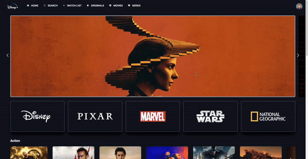

# Disney Clone 🎬

A modern, responsive **Disney+ Clone** built using **React.js**, **Tailwind** featuring a slider and  visually stunning UI.

---

## Table of Contents

1. [Demo](#demo)
2. [Features](#features)
3. [Tech Stack](#tech-stack)

---

## Demo

Check out the live version of the project here:  (Insert deployment link)

---

## Features

- 🎥 **Dynamic Content**: Fetches movie data dynamically using APIs.
- 🌐 **Responsive Design**: Fully optimized for desktop, tablet, and mobile devices.

---

## Tech Stack

- **Frontend**:
  - React.js
  - Tailwind CSS / Styled Components (specify your choice)

- **APIs**:
  - Disney+ content data (e.g., mock data or integrated API)
- **Build Tools**:
  - Vite 

